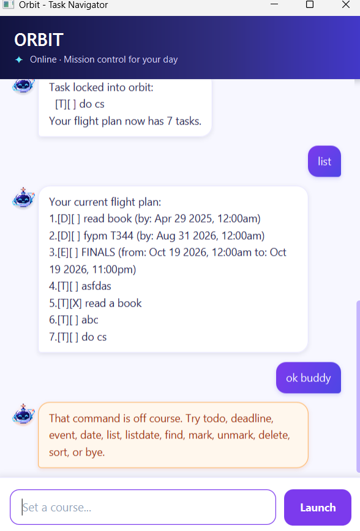

# Orbit User Guide



Orbit is a calm, mission-control-inspired task navigator for managing todos,
deadlines, and events in one flight plan. It provides a compact graphical chat
interface, highlights invalid commands, and saves task changes automatically.

## Quick start

Enter a command in the text field and press **Enter** or click **Send**. Commands
are case-insensitive, and Orbit ignores leading, trailing, and repeated spaces.

| Action | Command |
| --- | --- |
| Add a todo | `todo DESCRIPTION` |
| Add a deadline | `deadline DESCRIPTION /by DATE_OR_TIME` |
| Add an event | `event DESCRIPTION /from START /to END` |
| List every task | `list` |
| List tasks on a date | `date DATE` or `listdate DATE` |
| Find tasks | `find KEYWORD` |
| Mark a task complete | `mark NUMBER` |
| Mark a task incomplete | `unmark NUMBER` |
| Delete a task | `delete NUMBER` |
| Sort tasks chronologically | `sort date` |
| Exit Orbit | `bye` |

## Adding todos

Use `todo` for a task without a date or time.

Example:

```text
todo read a book
```

Orbit adds the todo to the end of the flight plan and assigns it a task number.

## Adding deadlines

Use `deadline` for a task that must be completed by a particular date or time.

Example:

```text
deadline submit report /by 2/12/2026 1800
```

The `/by` marker separates the description from the deadline.

## Adding events

Use `event` for an activity with a start and end date or time.

Example:

```text
event project meeting /from 2/12/2026 1400 /to 2/12/2026 1600
```

The start must be earlier than the end. Events spanning several days appear in
the results for every date within their range.

## Supported date formats

Orbit accepts the following date formats:

- `2/12/2026`
- `2-12-2026`
- `2026-12-02`

A time can be added in either 24-hour format:

- `2/12/2026 1800`
- `2/12/2026 18:00`

When no time is provided, Orbit uses midnight. Calendar dates are validated
strictly, so impossible dates such as February 30 are rejected.

## Viewing tasks

Use `list` to display every task and its current task number.

```text
list
```

Use `date` or `listdate` to display deadlines and events occurring on one date.

```text
date 2026-12-02
```

Todos do not appear in date-based results because they have no date.

## Finding tasks

Use `find` to search task descriptions. Matching is case-insensitive.

```text
find book
```

The results are displayed without changing the stored task list.

## Marking tasks

Use the number shown by `list` to mark a task as complete or incomplete.

```text
mark 1
unmark 1
```

Orbit reports an error if the number does not exist or the task already has the
requested completion state.

## Deleting tasks

Use `delete` with a task number to remove a task permanently.

```text
delete 2
```

Task numbers may change after deletion, so run `list` again before performing
another numbered action.

## Sorting tasks chronologically

Use `sort date` to reorder dated tasks from earliest to latest.

```text
sort date
```

Deadlines are ordered by their due time, while events are ordered by their start
time. Todos have no date, so they are placed after all deadlines and events.
Tasks with the same date and time retain their relative order.

Sorting changes task numbers and saves the new order. Tasks added afterward are
appended normally; run `sort date` again to reorder them.

## Saving tasks

Orbit automatically saves changes after adding, marking, unmarking, deleting,
or sorting tasks. Saved tasks are restored the next time the application starts.

## Handling invalid input and data problems

Orbit rejects unknown commands, missing or repeated date markers, duplicate
tasks, invalid task numbers, impossible dates, invalid event ranges, and unsafe
descriptions. A description cannot be empty, contain the reserved `|` character,
or exceed 300 characters.

If the saved data file contains malformed or duplicate records, Orbit loads the
remaining valid tasks and displays a warning. Saves use temporary-file
replacement to reduce the risk of damaging existing data during an interrupted
write.

## Exiting Orbit

Use `bye` to close the application safely.

```text
bye
```
